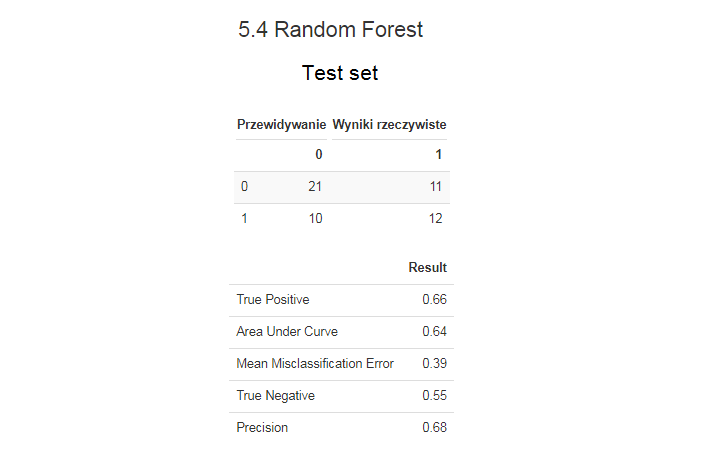
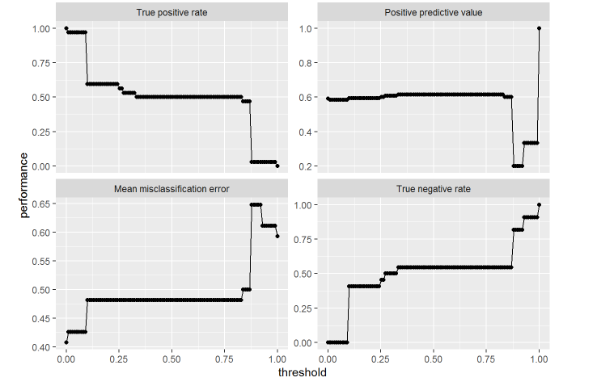

# Machine Learning - football result prediction

The betting market in Poland alone is worth around 5 billion PLN, and hundreds of thousands of 'players' are struggling with the problem of how to bet in order to maximise profits. This project concerns football matches, and more specifically, Scottish Premier League matches, which is the highest gaming league in the country. With the large number of variables affecting the outcome of a match and how unpredictable football is, it is extremely difficult to compose a good model. I will try to create models using four methods: **KNN**, **Naive Bayesian Classifier**, **Decision Tree** and **Random Forest**, with which it will be possible to predict whether the host will win this match, otherwise the match will be won by the visitor or there will be a draw.

 

## Data

The data were mostly downloaded from http://www.football-data.co.uk/scotlandm.php and relate to the 2017/2018 season, and some of them were obtained by means of webscraping. In their basic form, they were not suitable for the creation of models based on them, and therefore they have been processed, which is presented below. Moreover, the betting odds variables have been removed from the variables so that the study is based only on football statistics. There are no missing observations in the data set.

### Webscrapping 

In order to increase the number of variables, information has been extracted from https://www.fifaindex.com/pl/teams/fifa18_278/?league=50&order=desc on the average overall rating of each team in the Scottish Premier League for the 2017/2018 season. The team names have been adjusted to those in the downloaded file with the remaining variables. Although these are only numbers in the game, they are expertly created and contribute to the quality of the models.

## Files

The analysis file is made in Polish, but comments in the files with code are in English.

- **Data directory** - you can find there a csv file with match statistics from Scottish Premiership
- **HTML directory** - knitted file with "ipynb" extension, you can find there results and analysis (polish language)
- **Images directory** - you can find there plots included in README
- **ML_MateuszJalocha.Rmd** - project file (can be convrted into for example html file)
- **Project_ML.R** - project file

## Main libraries

- **mlr** - Machine Learning

- **ggplot2**, **corrplot** - Plots

- **grixExtra**, **kableExtra**, **flextable** - Rmarkdown

- **rvest** - Webscrapping

- **tidyverse**, **psych**, **officer**, **caret** - Generally useful libraries

## Contributors

- **Mateusz Jałocha** (mat.jalocha@gmail.com, https://www.linkedin.com/in/mateusz-jałocha-8942701b6/)
